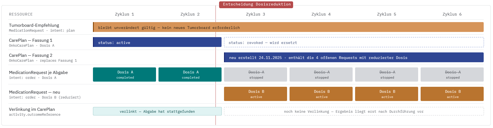
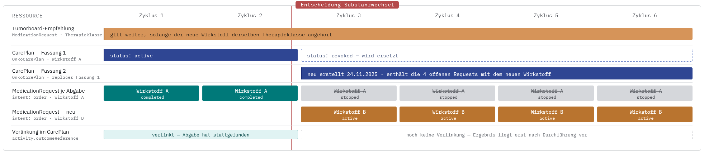
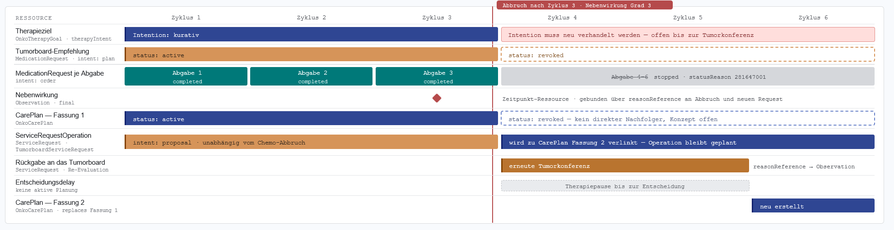
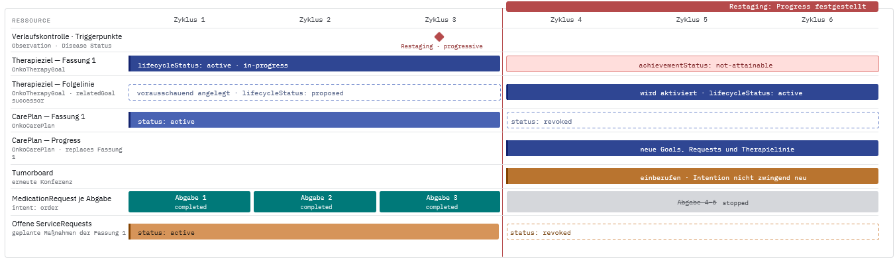
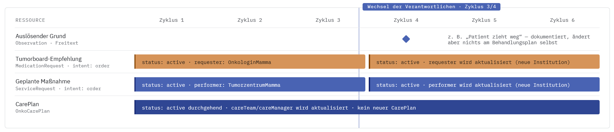
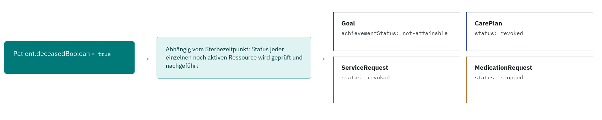

# Abweichende Szenarios - Implementierungsleitfaden Therapieziele Onkologie v1.0.0-ballot-rc.2

## Abweichende Szenarios

 
There is no translation page available for the current page, so it has been rendered in the default language 

Diese Seite ergänzt das [Anwendungsbeispiel Mammakarzinom (neoadjuvant)](szenario-mamma.md) um Verlaufsabweichungen vom dort beschriebenen Standardverlauf. Während das Hauptbeispiel einen unkomplizierten Verlauf mit pathologischer Komplettremission zeigt, treten in der klinischen Praxis regelmäßig Abweichungen von der ursprünglichen Therapieplanung auf, von planmäßigen Anpassungen bis hin zum vorzeitigen Abbruch der Therapielinie.

Für jedes der folgenden Szenarien wird gezeigt, wie sich das jeweilige klinische Ereignis auf **Ressourcenebene** abbilden lässt: welche Elemente sich ändern (z. B. `status`, `statusReason`), welche Verknüpfungen neu entstehen (z. B. `priorPrescription`, `reasonReference`) und welche Auswirkungen dies auf Therapielinie (`OnkoTherapyLine`) und Therapieziel (`OnkoTherapyGoal`) hat.

Die unten aufgeführten, beispielhaften Szenarien sind rein informativ und daher nicht in Bundles dargestellt.

### Reguläres Ende mit Dosisanpassung

Die Therapie wird wie geplant fortgeführt und abgeschlossen, die Dosis wird jedoch im Verlauf angepasst.

**Beispiel:** Die Tumorboard-Empfehlung wird umgesetzt, pro geplanter Abgabe entsteht ein `MedicationRequest`. Nach 2 von 6 Zyklen wird die Dosis reduziert. Die noch offenen Requests werden gestoppt und durch neue ersetzt, gebündelt in einem neuen `CarePlan`. Das Tumorboard wird dafür nicht erneut einberufen.

**Merkmale:**

* Die noch nicht durchgeführten `MedicationRequests` erhalten den Status `stopped`; im `statusReason` kann der entsprechende Code angegeben werden.
* Beim ursprünglichen `CarePlan` wird der Status auf `revoked` gesetzt. Ein neu erstellter `CarePlan` enthält die neuen `MedicationRequests` mit der angepassten Dosis, übernimmt aber die übrigen Merkmale des ursprünglichen CarePlans.
* Die Tumorboard-Empfehlung bleibt unverändert bestehen.

### Reguläres Ende mit Substanzwechsel

Die Therapie wird planmäßig abgeschlossen, ein oder mehrere Wirkstoffe des Regimes werden im Verlauf jedoch angepasst (ausgetauscht, ergänzt oder abgesetzt). **Abgrenzung**: gemeint ist immer ein Wirkstoffwechsel, nicht ein Arzneimittel- oder Präparatewechsel. Ein Fertigarzneimittel-Austausch bei gleichem Wirkstoff erzeugt weder einen neuen CarePlan noch einen Statuswechsel.

**Unterkategorien eines Substanzwechsels:**

* Wirkstoff wird ausgetauscht
* Neuer Wirkstoff kommt hinzu
* Wirkstoff fällt weg

**Beispiel:** Nach 2 von 6 Zyklen wird ein Wirkstoff ausgetauscht. Wie beim Dosiswechsel werden offene `MedicationRequests` gestoppt und in einem neuen `CarePlan` ersetzt. Ein reiner Austausch bleibt inhaltlich von der ursprünglichen Tumorboard-Empfehlung gedeckt (meist auf Ebene der Therapieklasse), das Tumorboard wird daher nie erneut einberufen.

**Merkmale:**

* Wirkstoff wird ausgetauscht: 
* Die noch nicht durchgeführten `MedicationRequests` erhalten den Status `stopped`; im `statusReason` kann der entsprechende Code angegeben werden.
* Beim ursprünglichen `CarePlan` wird der Status auf `revoked` gesetzt. Ein neu erstellter `CarePlan` enthält die neuen `MedicationRequests`, übernimmt aber die übrigen Merkmale (beispielsweise `TherapieIntent`) des ursprünglichen CarePlans.
* Das Tumorboard wird nicht neu einberufen, die Empfehlungen des Tumorboards bleiben somit bestehen.
 
* Neuer Wirkstoff kommt hinzu: 
* Die noch nicht durchgeführten `MedicationRequests` erhalten den Status `stopped`; im `statusReason` kann der entsprechende Code angegeben werden.
* Beim ursprünglichen `CarePlan` wird der Status auf `revoked` gesetzt. Ein neu erstellter `CarePlan` enthält die neuen `MedicationRequests`.
* Es kann sein, dass das Tumorboard neu einberufen werden muss; somit können sich die neuen Empfehlungen ändern und dementsprechend auch die Merkmale, die sonst vom ursprünglichen CarePlan übernommen würden.
 
* Wirkstoff fällt weg: 
* Die noch nicht durchgeführten `MedicationRequests` erhalten den Status `stopped`; im `statusReason` kann der entsprechende Code angegeben werden.
* Es werden keine neuen `MedicationRequests` erstellt, es sei denn es handelt sich um eine Medikationskombination, welche in einem `MedicationRequest` abgebildet wird. Hierfür muss dann ein neuer `CarePlan` erstellt werden. Wenn das Tumorboard neu einberufen werden muss, können sich auch hier die Merkmale des ursprünglichen CarePlans ändern. Andernfalls bleiben die Merkmale gleich.
 

### Abbruch wegen Nebenwirkung

Die Therapielinie wird vorzeitig beendet, da eine behandlungsassoziierte Nebenwirkung die Fortführung nicht zulässt.

**Beispiel:** Nach 2 von 6 Zyklen treten schwerwiegende Nebenwirkungen ein, sodass die Chemotherapie abgebrochen werden muss. Das Tumorboard wird erneut einberufen und ein neuer `CarePlan` mit entsprechendem `TherapieIntent`, `Goals` und Behandlungsvorschlägen erstellt. Ein bereits geplanter `ServiceRequest` (z. B. für begleitende Diagnostik) wird dabei unverändert aus dem bisherigen CarePlan in den neu erstellten CarePlan übernommen.

**Merkmale:**

* Die noch nicht durchgeführten `MedicationRequests` erhalten den Status `stopped`; im `statusReason` kann der entsprechende Code angegeben werden.
* Soll ein bereits geplanter `ServiceRequest` nicht mehr durchgeführt werden, wird dessen Status auf `revoked` gesetzt.
* Beim ursprünglichen `CarePlan` wird der Status auf `revoked` gesetzt.
* Die aufgetretenen Nebenwirkungen werden in `Observations` abgebildet. Diese können dann entsprechend als `reasonReference` bei der neuen Medikation verlinkt werden.
* Das Tumorboard wird neu einberufen, daraus entsteht ein neuer `CarePlan`. Dieser enthält die neue Behandlungstherapie und kann einen anderen `TherapieIntent` sowie andere `Goals` besitzen.

### Abbruch wegen Progress

Die Therapielinie wird vorzeitig beendet, da unter der Behandlung ein Progress der Erkrankung festgestellt wird.

**Beispiel:** Nach 3 Zyklen findet ein Progress der Erkrankung statt. Dies führt dazu, dass die initiale Therapie so nicht weitergeführt werden kann. Da zu Beginn aber bereits ein potenzieller Progress der Erkrankung im ersten Tumorboard mit eingeplant wurde, wurde bereits ein `CarePlan` erstellt, welcher umgesetzt werden soll, sobald es zu einem Progress kommt.

**Merkmale:**

* Die noch nicht durchgeführten `MedicationRequests` erhalten den Status `stopped`; im `statusReason` kann der entsprechende Code angegeben werden.
* Soll ein bereits geplanter `ServiceRequest` nicht mehr durchgeführt werden, wird dessen Status auf `revoked` gesetzt.
* Beim ursprünglichen `CarePlan` wird der Status auf `revoked` gesetzt.
* Wurde beim ersten Tumorboard bereits ein `CarePlan` für den Progressfall vorbereitet, wird dessen Status nun auf `active` gesetzt, statt einen neuen CarePlan zu erstellen.
* Falls beim erstmaligen Treffen des Tumorboards kein CarePlan für einen Progress beschlossen wurde, muss das Tumorboard neu einberufen werden. Daraus entsteht ein neuer `CarePlan`. Dieser enthält die neue Behandlungstherapie und kann einen anderen `TherapieIntent` sowie andere `Goals` besitzen.

### Abbruch aus anderen Gründen

Die Therapielinie wird aus Gründen beendet, die nicht unmittelbar in der Erkrankung oder der Therapie selbst liegen.

**Beispiel:** Der Grund ist medizinisch nicht begründet, z. B. Patient zieht weg, Arzt-Patienten-Verhältnis gestört, Unfall. Die Tumorboard-Empfehlung selbst bleibt inhaltlich unverändert gültig, `MedicationRequest` und `ServiceRequest` laufen weiter mit Status `active`. Es ändern sich nur die Verantwortlichen, `requester`, `performer` bzw. `careManager` werden aktualisiert, kein Statuswechsel, kein Ersatz.

**Merkmale:**

* Die Empfehlung des Tumorboards bleibt inhaltlich und im Status unverändert `active`. Es ändern sich nur die Referenzen auf die Verantwortlichen — `requester`, `performer` bzw. `careManager` — auf den Ressourcen selbst, ohne dass diese ersetzt, gestoppt oder neu angelegt werden.

### Versterben der Patientin

Die Patientin verstirbt während der laufenden Therapielinie.

**Beispiel:** Die Patientin verstirbt während der Behandlung. Dementsprechend wird die Patientenressource geändert. Folglich müssen die noch offenen Ressourcen im Status angepasst werden.

**Merkmale:**

* In der Patientenressource wird das Element `Patient.deceasedBoolean` auf `true` gesetzt.
* Alle noch offenen Ressourcen wie `MedicationRequest`, `ServiceRequest`, `CarePlan` und `Goal` müssen auf den entsprechenden Abbruchstatus gesetzt werden. Falls ein `statusReason` bei der Ressource vorhanden ist, kann der entsprechende Code angegeben werden.

