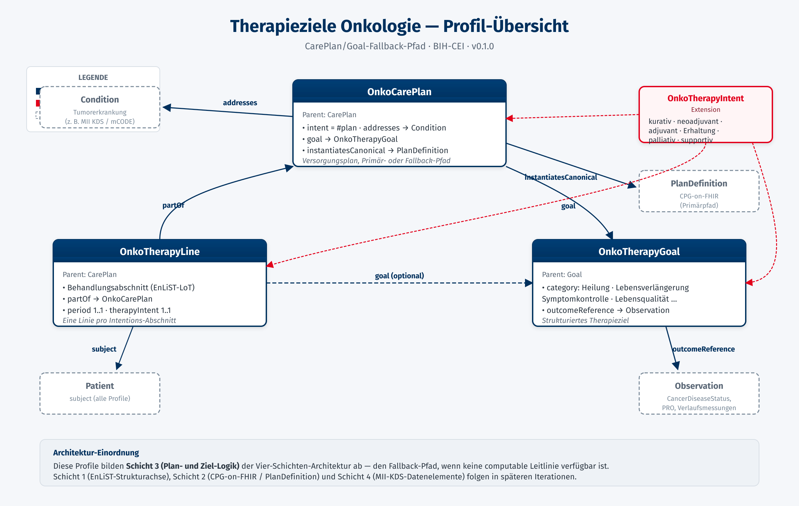

# Startseite - Implementierungsleitfaden Therapieziele Onkologie v0.1.0

## Startseite

### Therapieziele Onkologie

Dieser Implementierungsleitfaden definiert FHIR-Profile zur Dokumentation **onkologischer Therapieziele** — also der Ziele, die Patient:innen und behandelndes Team gemeinsam festlegen, wenn ein Tumortherapieplan aufgestellt wird (z. B. kurative Intention, Lebensverlängerung, Symptomkontrolle, Lebensqualität).

Er entsteht im Rahmen der BIH-CEI / Gematik-Onkologie-Kooperation und wird auf Deutsch mit englischer Übersetzung veröffentlicht.

#### Erste Profile

Der initiale Profilsatz folgt der im [Analysebericht](analysebericht.md) festgelegten Vier-Schichten-Architektur und bildet den **CarePlan-/Goal-Fallback-Pfad** ab:

* **[OnkoCarePlan](StructureDefinition-onko-care-plan.md)** — onkologischer Versorgungsplan mit Therapieintention, adressierter Tumorerkrankung und Bezug zu Therapielinien.
* **[OnkoTherapyLine](StructureDefinition-onko-therapy-line.md)** — Therapielinie (EnLiST-konform) als Behandlungsabschnitt mit eigener Intention.
* **[OnkoTherapyGoal](StructureDefinition-onko-therapy-goal.md)** — strukturiertes Therapieziel mit codierter Zielart (Heilung, Lebensverlängerung, Symptomkontrolle, Lebensqualität).
* **[OnkoTherapyIntent](StructureDefinition-onko-therapy-intent.md)** — Extension für die Therapieintention (kurativ, neoadjuvant, adjuvant, Erhaltung, palliativ, supportiv).

Begleitende Terminologien: [OnkoTherapyGoalType](CodeSystem-onko-therapy-goal-type.md) und [OnkoTherapyIntent](CodeSystem-onko-therapy-intent.md).

Der CPG-on-FHIR-Primärpfad (`PlanDefinition`, `ActivityDefinition`, `Library`) und die MII-KDS-Anbindung folgen in späteren Iterationen.

