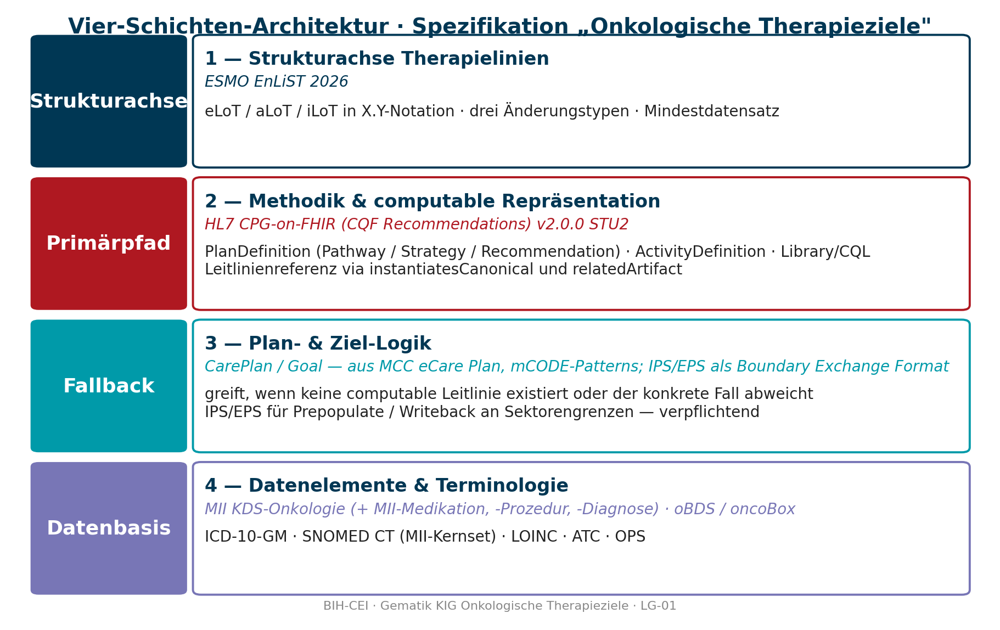

# Architekturentscheidung – Spezifikation „Onkologische Therapieziele"

Baustein für Liefergegenstand LG-01 · Gematik-Auftrag · BIH-CEI

## Kernaussage

Die Spezifikation beruht auf vier Schichten mit klarer Rollenverteilung und einem expliziten Fallback-Pfad:

## Rollen der vier Schichten

**Schicht 1 – Therapielinien-Strukturachse (EnLiST):** liefert die internationale Konsensnotation für Linien, Settings und Änderungstypen. Definiert *was* gezählt wird und *wie* es dargestellt wird. Konzeptionell, nicht profiltechnisch.

**Schicht 2 – Methodik & computable Repräsentation (CPG-on-FHIR):** liefert die Vorgehensweise (Select → Represent → Translate → Validate, L1–L4-Continuum) und das FHIR-Profil-Set (PlanDefinition, ActivityDefinition, Library, Definition–Request–Event-Triade). Wird im **Primärpfad** verwendet: existiert für den Fall eine computable Leitlinienempfehlung, wird sie via `instantiatesCanonical` referenziert – kompakte Darstellung, keine Wiederholung des normativen Inhalts.

**Schicht 3 – Plan- und Ziel-Logik (CarePlan / Goal):** liefert die generische Repräsentation des realen Versorgungsverlaufs. Wird im **Fallback** verwendet:
1. wenn für den klinischen Fall keine computable Leitlinienempfehlung existiert (Off-Label, seltene Tumoren, Studienteilnahme, palliative Sondersituationen);
2. wenn der reale Verlauf von der Leitlinie abweicht (bewusst, unbewusst oder kontraindiziert) – dann wird der CarePlan zum Detailbild neben dem Verweisbild auf die Leitlinie.

Quellen für das Plan-/Ziel-Pattern: MCC eCare Plan, mCODE-Treatment-Pattern, ergänzt um die Inhaltsstruktur aus IPS (Plan-of-Care-Sektion).

**IPS/EPS als Boundary Exchange Format – verpflichtend zu berücksichtigen:** IPS ist in dieser Architektur **kein** Fallback-Standard, sondern ein **Brückenformat** an den Sektorengrenzen. Konkrete Rollen:

- **Prepopulate:** Beim Übergang von Versorgungssektor zu Versorgungssektor (z. B. Klinikaufnahme nach ambulanter Vorgeschichte, Reha-Verlegung) wird unsere Spec aus einem IPS-/EPS-Dokument *vorbefüllt* – Diagnosen, Medikation, Allergien, ggf. Therapieabschnitte werden übernommen.
- **Writeback:** Beim Sektorenwechsel in die Gegenrichtung schreiben wir die aktuelle Therapieziel-/Therapielinien-Sicht so in ein IPS-/EPS-Dokument zurück, dass die Folgesektoren sie verlustarm lesen können.
- **EHDS-Anschluss:** EPS ist die strategische Bezugsgröße für EHDS-/EEHRxF-Konformität und damit hochrelevant für den **Datenaustausch innerhalb Europas**.

Daraus folgt: Unsere Spec MUSS ein **IPS-/EPS-Mapping** als eigenes Lieferobjekt führen und die Boundary-Transactions sauber abbilden. Die Empfehlung „Plan-/Ziel-Quelle ist nicht IPS" gilt nur für den internen Modellierungspfad, nicht für die Sektorengrenze.

**Schicht 4 – Datenelemente & Terminologie (MII Onkologie):** liefert die deutschen Datenelemente und Terminologien als primäre Interoperabilitätsbasis. Anschluss an EHDS via Mapping auf IPS/EPS als sekundäre Schicht.

## Fallback-Logik: wann Primärpfad, wann Fallback

| Situation | Schicht 2 (CPG) | Schicht 3 (CarePlan/Goal) |
|---|---|---|
| Leitliniengerechte 1L bei häufigem Tumor (z. B. KRK mFOLFOX6) | Primär – `instantiatesCanonical` auf normative Recommendation | Optional – kompakter CarePlan als Container für Verweis |
| Bewusste Abweichung (Patient\*innenpräferenz, Komorbidität) | Verweis bleibt | **Fallback aktiv** – CarePlan mit Detailbeschreibung + `CPGDetectedIssue` |
| Seltene Tumoren / Off-Label / keine computable Leitlinie | – | **Fallback aktiv** – CarePlan + Goal als alleinige Repräsentation |
| Studienteilnahme (iLoT in EnLiST) | Wenn Studienprotokoll als CPG vorliegt: Verweis | Sonst Fallback – CarePlan referenziert ResearchStudy |
| Versorgungsdrift / unbewusste Abweichung | Verweis bleibt | **Fallback aktiv** – CarePlan + `CPGDetectedIssue` als Audit-Anker |
| Tumorboard-Entscheidung mit eigener Empfehlung | Verweis auf S3-Leitlinie + `OnkoTumorboardDecision` als ergänzende Recommendation | CarePlan als Container; bei Abweichung zusätzlich Fallback |

## Implikation für die Profile

Die FHIR-Profile der Spec gliedern sich entsprechend:

- **EnLiST-konforme Profile:** `OnkoTherapyLine`, `OnkoTherapyIntent`-Extension, `OnkoClinicalSetting`-Extension
- **CPG-on-FHIR-basierte Profile (Primärpfad):** `OnkoPathwayDefinition` (auf `CPGPathwayDefinition`), `OnkoStrategyDefinition`, `OnkoRecommendationDefinition`, `OnkoMedicationRequest` (auf `CPGMedicationRequest`) etc.
- **CarePlan/Goal-Profile (Fallback):** `OnkoCarePlan` (auf `CPGCarePlan`, der wiederum CarePlan profiliert), `OnkoGoal` (mit Therapieziel-Codierung), `OnkoDetectedIssue` für Abweichungsbegründung
- **MII-Anschluss-Profile (Datenelemente):** Slicing auf MII KDS-Profile (Medikation, Prozedur, Diagnose) als Basis für `OnkoMedicationStatement`, `OnkoProcedure`, `OnkoCondition`

## Warum diese Architektur

- **EnLiST** ist alternativlos: einziger paneuropäischer Delphi-Konsens für solide Tumoren, international anschlussfähig, sonst nichts Vergleichbares.
- **CPG-on-FHIR** ist alternativlos: einziges FHIR-natives Framework mit Methodik **und** Profil-Set für computable Leitlinien; Alternativen (Quality Measure IG, SDC, CDS Hooks pur) decken nur Teilaspekte.
- **CarePlan/Goal als Fallback** ist notwendig: WiZen-/internationale Studien zeigen 15–30 % strukturierte Abweichung; für seltene Tumoren und Studieneinsätze fehlen computable Leitlinien systematisch. Ohne Fallback bleibt jeder vierte bis fünfte Verlauf unmodellierbar.
- **MII KDS-Onkologie als Datenelemente-Basis** ist gesetzt: deutsche Versorgungsrealität, etablierte DIZ-Datenflüsse, gematik-/MII-Mandat. IPS/EPS sekundär für EHDS-Konformität.

## Out-of-Scope-Entscheidungen mit Begründung

- **Hämatologische Malignome:** als separate IG-Seite (Phasen- statt Setting-Achse), nicht im Kern-Datenmodell. Begründung: EnLiST adressiert sie nicht; hämatologisches Pendant existiert noch nicht; Versorgungslogik (Induktion-Konsolidierung-Maintenance, Allo-SZT, CAR-T) unterscheidet sich strukturell.
- **Lokoregionale Therapien** (Chirurgie, Strahlentherapie, Ablation): in der Visualisierung als eigene Modalitäten-Spur, nicht in die LoT-Zählung. Begründung: EnLiST-konform; klinisch hochrelevant, aber konzeptuell von Systemtherapie zu trennen.
- **Patient-Reported-Outcomes:** via PCO IG anbinden, nicht selbst entwickeln. Begründung: PCO ist die international etablierte Lösung; Eigenentwicklung wäre Duplizierung.
- **EHDS-Anschluss:** via Mapping-Schicht auf IPS/EPS, nicht durch IPS-konforme Composition als Primärformat. Begründung: für computable Pfade ist IPS-Composition zu schmal (siehe IPS/EPS-Baustein).

## Konsequenzen für die Folgephasen

- **Workshop 1 (Anforderungserhebung):** Use Cases auswählen, die alle vier Schichten exemplifizieren – empfohlen: KRK 1L (Primärpfad), mBC mit Komorbidität (Fallback wegen Abweichung), Sarkom in Studie (Fallback wegen iLoT/fehlender Leitlinie). Ein **Molekulares Tumorboard**-Use-Case soll explizit aufgenommen werden, um die Verzahnung von genomischen Befunden, CPG-Recommendations und CarePlan-Abweichungen zu prüfen.
- **Informationsmodell:** auf Basis der vier Schichten gegliedert, klare Trennung zwischen normativer Empfehlung und realer Versorgung.
- **IG-Entwurf:** Profil-Set wie oben skizziert; CPG-on-FHIR und CarePlan/Goal-Pattern als verbundenes Set in FSH/SUSHI.
- **MII-Integrationskonzept:** Schicht 4 in den MII-AGs Onkologie und Medikation gespiegelt.
